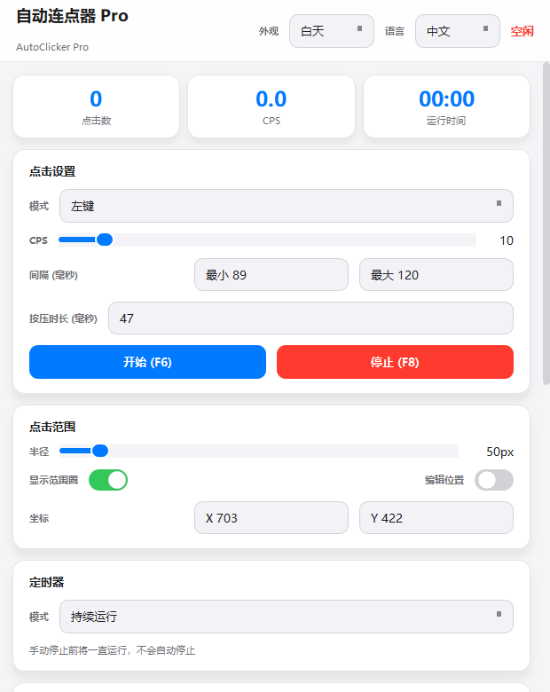
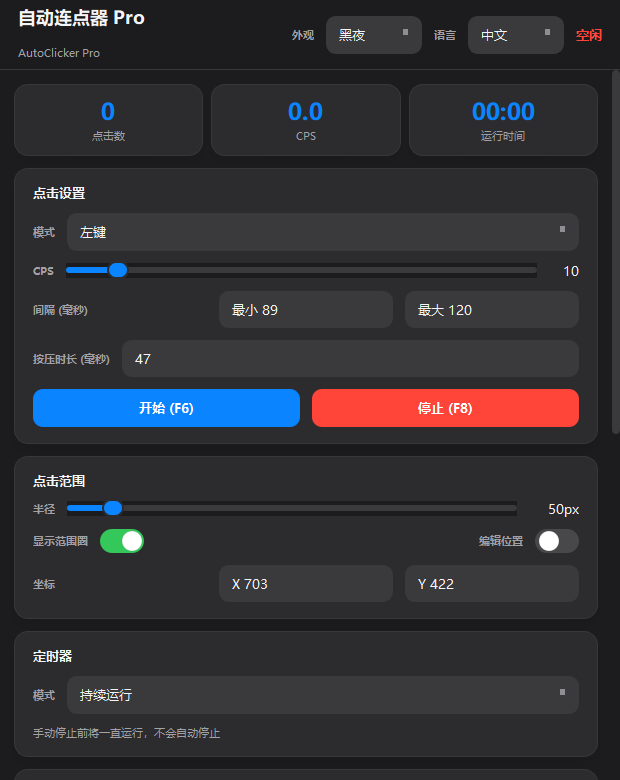
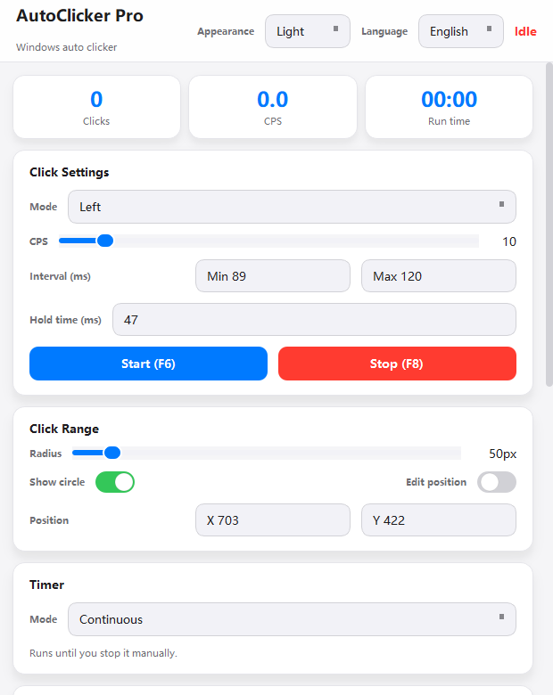
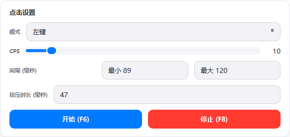
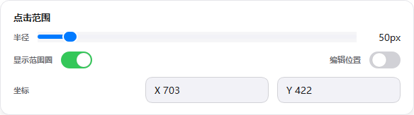
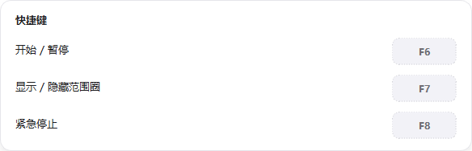

# AutoClicker Pro

[](README.md)
[](README_en.md)

AutoClicker Pro is a Windows auto clicker with CPS control, random range clicking, countdown/delayed start, human-like clicking, and global hotkeys. The interface supports **System / Light / Dark** appearance modes and **Default / 中文 / English** language modes.

## Preview

| Light Chinese | Dark Chinese | English |
| --- | --- | --- |
|  |  |  |

## Quick Guide

### 1. Choose Appearance And Language


Use the controls in the title bar to switch appearance and language. Appearance defaults to `System`; language defaults to `Default`, which follows the user's system language.

### 2. Configure Clicks



- `Mode`: choose left click, right click, double click, or hold.
- `CPS`: adjust clicks per second.
- `Interval`: keep min/max intervals when you want more natural clicks.
- `Start (F6)` / `Stop (F8)`: control the clicker directly.

### 3. Configure Click Range



- `Radius`: controls the random click area size.
- `Show circle`: displays the click area on screen.
- `Edit position`: allows dragging the range circle.
- `Position`: enter X / Y coordinates directly.

### 4. Use Hotkeys



| Action | Default hotkey |
| --- | --- |
| Start / Pause | F6 |
| Show / Hide circle | F7 |
| Emergency stop | F8 |

Click a hotkey button in the app to record a new key.

## Run From Source

```bash
pip install -r requirements.txt
python main.py
```

## Build Exe

```bash
pyinstaller AutoClickerPro.spec
```

You can also run `build.bat`. The built executable is generated under `dist/`.

## Requirements

- Windows 10 / 11
- Python 3.9+

## Tech Stack

- **PySide6**: desktop UI
- **pynput**: global keyboard listener
- **ctypes (SendInput)**: low-latency Windows clicks
- **PyInstaller**: standalone exe packaging

## Project Structure

```
├── main.py                 # App entry
├── README_en.md            # English README
├── requirements.txt        # Python dependencies
├── build.bat               # One-click build script
├── resources/              # README image assets
├── core/                   # Core logic
│   ├── click_engine.py     # Click engine
│   ├── click_simulator.py  # Human-like behavior
│   ├── config_manager.py   # Config management
│   └── hotkey_manager.py   # Hotkey management
└── ui/                     # UI components
    ├── i18n.py             # Chinese/English UI text
    ├── main_window.py      # Main window
    ├── overlay.py          # Range circle overlay
    ├── styles.py           # Light/dark themes
    └── widgets.py          # Custom widgets
```
